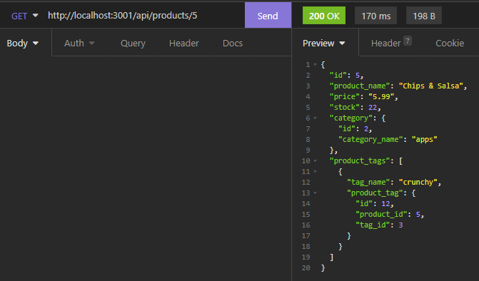
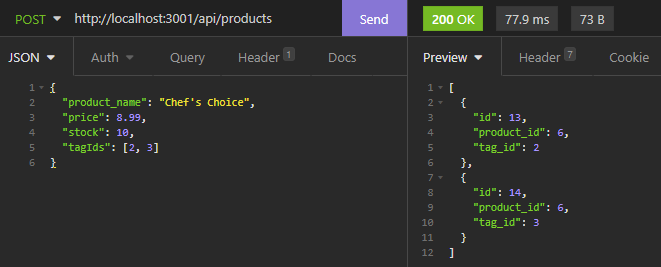
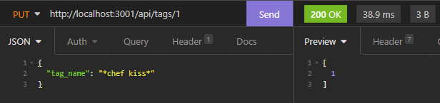
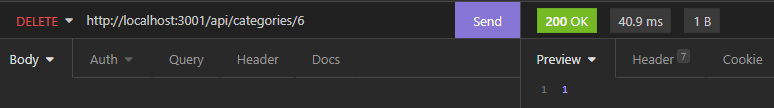

# nom-nom-ecomm

## Description
Time to bring your family-owned restaurant business online with nom-nom-ecomm! This back end service provides a way for you to organize your wares so you can keep track of your menu and quickly update it when things change. Now you can put your dishes into neat categories and give them tags to help customers understand what you offer. You can even add tags or categories for things you might be interested in offering in the future, but this way those great ideas won't be lost on a dirty napkin you swore you'd save...

_App Sample Screenshots_

### Access

Clone the repository to your local machine, navigate to the root directory of the repository, then login to MySQL Shell and run "source db/schema.sql" to set up the database. Exit the MySQL Shell and enter "npm run seed" to seed it with the provided data then run "npm start" from the command line.

[Demo Video](https://watch.screencastify.com/v/2c7HZfGhNR3kwt8ZboQq)

### Future Enhancements Roadmap

* add enhancements to updating products
* add a front-end to mimic ordering food online
